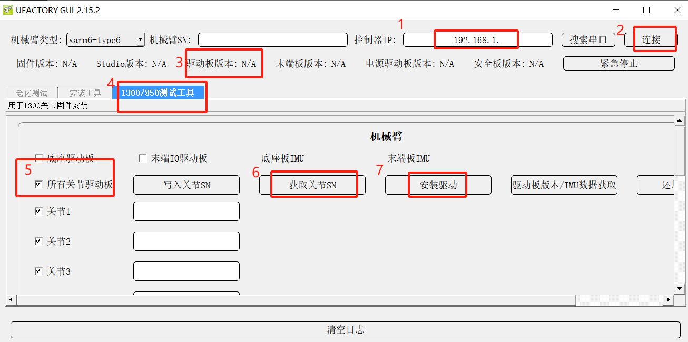

# 如何升级 13xx 以及 850 系列的关节固件

---

### **步骤 1：确认机臂 SN**
在开始升级之前，请仔细确认机臂底部附近的 SN（序列号）。

---

### **步骤 2：下载工具**
1. 下载 `xarm-too-gui.zip`。

---

### **步骤 3：启动工具**
1. 解压后，运行 `xarm-tool-gui-win.exe`（需要 Windows 系统）。
2. 输入控制器的 IP 地址，点击 **[连接]**，然后查看驱动版本。

---

### **步骤 4：检查驱动版本**
- 如果驱动版本低于 **V5.0.8**，请按照以下步骤升级到 **V5.0.8**。

---

### **步骤 5：升级驱动**
1. 在工具中选择 **1300/850 测试工具**。
2. 选择 **[所有关节驱动板]**，然后点击 **[安装驱动]**。
3. 按下急停按钮，等待 5 秒后松开，点击 **[下一步]**。工具将自动开始升级。

---

### **步骤 6：完成升级**
- 升级过程大约需要 1 分钟，工具会提示 **安装成功**。
- 点击 **[确定]**，整个系统将自动重启。
- 重新连接机械臂，并检查驱动版本是否为 **V5.0.8**。

---

### **注意事项**
- 确保在升级过程中不要断电或中断连接。
- 如果升级失败，请重新尝试上述步骤。

---

